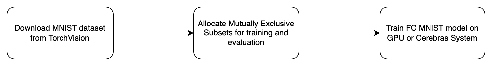

# List of topics
- [Overview of the FC-MNIST model](#overview-of-the-fc-mnist-model)
- [Sequence of the steps to perform](#sequence-of-the-steps-to-perform)
- [Key features from CSoft platform used in this reference implementation](#Key-features-from-CSoft-platform-used-in-this-reference-implementation)
- [Structure of the code](#structure-of-the-code)
- [Dataset and input pipeline](#dataset-and-input-pipeline)
- [How to run](#how-to-run)
- [Configurations included for this model](#configurations-included-for-this-model)
- [References](#references)
# Overview of the FC-MNIST model

A simple multi-layer perceptron model composed of fully-connected layers
for performing handwriting recognition on the MNIST dataset.
The model is a `3`-layer multi-layer perceptron. The first layer has hidden
size `500`, the second `300`, and the third layer has `num_classes` number of
hidden units (which here is `10`). It then trains on a categorical cross entropy
loss. This structure is based on the survey of different structures on the
MNIST website [ref #2](#references).

# Sequence of the steps to perform
See the following diagram:



# Key features from CSoft platform used in this reference implementation
FC MNIST model configs are supported in the [Layer Pipelined mode](https://docs.cerebras.net/en/latest/cerebras-basics/cerebras-execution-modes.html#layer-pipelined-mode).

## Multi-Replica data parallel training
When training on the Cerebras System, the `--multireplica` flag can be used to perform data-parallel training
across multiple copies of the model at the same time. For more details about this feature, please refer
to [Multi-Replica Data Parallel Training](https://docs.cerebras.net/en/private/general/multi-replica-data-parallel-training.html) documentation page.

# Structure of the code
* `data.py`: Simple data input pipeline loading the [TorchVision MNIST dataset](https://pytorch.org/vision/stable/datasets.html).
* `model.py`: Model implementation. 
* `configs/params.yaml`: Example of a YAML configurations file.
* `run.py`: Train script, performs training and validation.
* `utils.py`: Miscellaneous helper functions.

# Dataset and input pipeline

The MNIST dataset comes from `torchvision.datasets`. The train dataset
has a size of `60,000` and the eval dataset `10,000` images.
More information can be found on the
[PyTorch website](https://pytorch.org/vision/0.8/datasets.html#mnist).
Each sample in the dataset is a black and white image of size `28x28`, where
each pixel is an integer from `0 to 255` inclusive.

The first time that the input function is run, it will take some time
to download the entire dataset.
The dataset is to downloaded to the `data_dir` provided in [`configs/params.yaml`](./configs/params.yaml).

The input pipeline does minimal processing on this dataset. The dataset returns one batch at a time, of the form:
```
inputs = (
    features = Tensor(size=(batch_size, 28*28), dtype=torch.floatX,
    labels = Tensor(size=(batch_size,), dtype=torch.int32,
)
```
Where here, `torch.floatX = torch.float32` if we are running in full precision and float16 if we are running in mixed precision mode. You can simply set the mixed precision mode by passing `model.mixed_precision False` as part of the arguments.


# How to run:
Here we provide how to
    1) Compile and validate
    2) Train and eval on Cerebras System
    3) Train and eval on GPU/CPU
We use [`params.yaml`](configs/params.yaml) as an example, if you want to modify this configuration, or provide your own, please refer to the section [Configurations included for this model](#Configurations-included-for-this-model).

## To compile and validate
When running inside of the Cerebras environment, the train script will by default attempt to compile the graph for the Cerebras System up to checking kernel compatibility.

Running with `--validate_only` flag will go up to step 2 at kernel matching and no executable will be generated, running with `--compile_only` will generate the executable at the end. When running with `--validate_only` or `--compile_only` commands, it's recommended to use `csrun_cpu` instead of `csrun_wse` and remove an argument `--cs_ip`. This is because the compilation can be performed immediately on CPU without going through orchestration to queue the job. You can always test compilation on CPU while training something else on WSE. For example you simply add the flag and get:

```bash
csrun_wse python-pt run.py --params configs/params.yaml --validate_only
```
## To run train and eval on Cerebras System
To run pre-training in pipeline mode on the Cerebras System, you will need to modify the above training command to run inside of the Cerebras environment. In addition, the `cs_ip` should be provided either as a command line argument `--cs_ip` or in the YAML config file.

To run with [`params.yaml`](configs/params.yaml), please execute the next command:
```bash
csrun_wse python-pt run.py --params configs/params.yaml
```

## To run train and eval on GPU/CPU

If running on  a cpu or gpu simply run:
```bash
python run.py --mode train --params configs/params.yaml
```

If run outside of the Cerebras environment with `--mode train`, it will skip validation and compilation steps and proceed straight to the training on your allocated hardware.


# Configurations included for this model
In the [configs](./configs/) directory we have config files to train FC-MNIST model.
    * [params.yaml](./configs/params.yaml) with `depth=10`, `hidden_size=50`, and `SGD` optimizer.

# References

1. [Original MLP MNIST paper](http://yann.lecun.com/exdb/publis/pdf/lecun-98.pdf)
2. [MNIST website with wide survey of different parameters](
    http://yann.lecun.com/exdb/mnist/)
