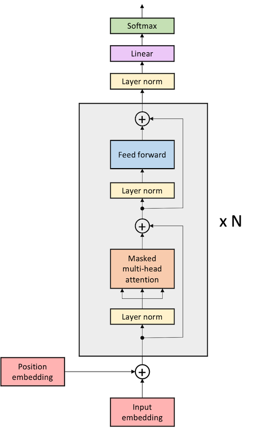

# GPT-2/3 Language Models

This directory contains the TensorFlow ML reference for GPT-2 and GPT-3 models.

1.  [Overview of the models](#overview-of-the-models)
1.  [Steps for running model training](#steps-for-running-model-training)
1.  [Key CSoft features](#key-csoft-features)
1.  [Structure of the code](#structure-of-the-code)
1.  [Prepare the data](#prepare-the-data)
1.  [Input function](#input-function)
1.  [How to run](#How-to-run)
1.  [Configs included for this model](#configs-included-for-this-model)
1.  [Appendix](#appendix)


## Overview of the models

### GPT-2

[GPT-2](https://d4mucfpksywv.cloudfront.net/better-language-models/language-models.pdf)
is a decoder-only transformer-based model designed by OpenAI.
It uses a stack of transformer blocks with dot-product
self-attention followed by a multi-layer perceptron feed-forward network.



GPT-2 has the following features:

-   **Autoregressive language modeling**: The model predicts the next token from
the prior context at every position in the sequence (compare to [BERT](https://arxiv.org/abs/1810.04805), which uses an autoencoding
loss that predicts masked positions from the rest of the unmasked sequence).
Autoregressive language modeling requires masking the future positions in the
sequence.
-   **Layer norms** in the transformer blocks are **located inside the residual
connections** ahead of the self-attention or feed-forward network
(compare to [BERT](https://arxiv.org/abs/1810.04805) and [GPT](https://s3-us-west-2.amazonaws.com/openai-assets/research-covers/language-unsupervised/language_understanding_paper.pdf), which have layer norms outside of the residual block).
The GPT-2 layer norm location helps to stabalize training for large and deep models.
-   GPT-2 does not add any auxiliary losses (compare to [BERT](https://arxiv.org/abs/1810.04805), which uses next sentence prediction
(NSP), or [ALBERT](https://arxiv.org/abs/1909.11942) which uses sentence-order prediction (SOP)).

GPT-2 with 48-layers, and a total of 1542M parameters, has more than an order of magnitude more
parameters than GPT.


### GPT-3

[GPT-3](https://arxiv.org/abs/2005.14165) is a very similar architecture to GPT-2 except that every other
self-attention layer in GPT-3 uses locally banded sparse attention in which
tokens only attend to each other if they are nearby in the sequence
(see section 2.1 of the [GPT-3 paper](https://arxiv.org/abs/2005.14165) for more details).
The larger versions of GPT-3 range from 1.3B to 175B parameters.


## Steps for running model training
In order to run any of the models in this directory, you must go through the following steps:
- Download and preprocess the data (see [input/README.md](./input/README.md) for more details)
  - Download the OpenWebText compressed tar file
  - Extract the text files
  - Allocate mutually exclusive subsets of the data for training and evaluation; create the corresponding metadata files
  - Use the [create_tfrecords.py](./input/create_tfrecords.py) script to convert text files into TFRecords files
- Run training for your desired model (see [Run pre-training](#run-pre-training))


## Key CSoft features
The Cerebras Wafer Scale Engine supports two different execution modes:
- Layer pipelined: all layers of a model are loaded onto the Cerebras WSE at once and samples are streamed through one at a time in a pipeline parallel manner.
- Weight streaming: layers of the model are loaded onto the Cerebras WSE one at a time and executed in a data parallel manner.

This GPT implementation supports both pipelined and weight streaming execution modes.

For more details on Cerebras execution modes, see [this explanation](https://docs.cerebras.net/en/latest/cerebras-basics/cerebras-execution-modes.html).


## Structure of the code

-   `configs/`: YAML configuration files.
-   `input/`: Input pipeline implementation using the [OpenWebText dataset](https://skylion007.github.io/OpenWebTextCorpus/).
-   `Gpt2Model.py`: Model implementation. A bulk of the model is defined here. It inherits from the
    central `TFBaseModel` located in [common/tf/TFBaseModel.py](../../../common/tf/TFBaseModel.py).
    The model also uses Cerebras-defined layers that are located in [common/tf/layers](../../../common/tf/layers).
-   `data.py`: The entry point to the data input pipeline code. Defines the `input_fn` function.
-   `model.py`: The entry point to the model. Defines `model_fn`.
-   `run.py`: Training script. Performs training and validation.
-   `utils.py`: Miscellaneous scripts, including `get_params` to parse the `params` dictionary from the YAML files.


## Prepare the data

First you need to download your raw data and create preprocessed TFRecords;
see details how to in [input/README.md](./input/README.md).


## Input function

This section describes the input data format expected by `Gpt2Model`. If you want to define your own dataloader for this model,
the easiest way to do it is to conform to this format in order to avoid model changes. See [GptTfRecordsProcessor](./input/GptTfRecordsProcessor) for an example dataloader.

When you create your own custom input function, you must ensure that your input function produces a tuple of
`(features, labels)`, where the features dictionary and a label tensor as described in this section.

### Features dictionary

The features dictionary has the following key/values:

-   `input_ids`: Input token IDs, padded with `0` to `max_sequence_length`.
    -   Shape: `(batch_size, max_sequence_length)`
    -   Type: `tf.int32`
-   `input_mask`: Mask for padded positions. Has values `1` on the padded positions and `0` elsewhere.
    -   Shape: `(batch_size, max_sequence_length)`
    -   Type: `tf.int32`

See the [input README](./input/README.md#table-1-data-features-in-the-generated-tfrecords) for more details.

### Label tensor

The label tensor of shape `(batch_size,)`. Carries the next token labels.


### Input pipeline with sharding

In addition, the above-created TFRecords are used by the `GptTfRecordsProcessor` class to create a sharded dataset, using the `shard_dataset.py` utility. This allows multiple workers to stream data at once without repeating samples. For a detailed explanation of sharding, see <a href="https://docs.cerebras.net/en/latest/tensorflow-docs/preparing-tf-input/sharding-for-cs.html" class="external-link">Sharding For the Cerebras System</a>.


## How to run

**IMPORTANT**: See the following notes before proceeding further.

**Parameter settings in YAML config file**: The config YAML files are located in the [configs](configs/) directory. Before starting a pre-training run, make sure that in the YAML config file you are using:

-   The `train_input.data_dir` parameter points to the correct dataset, and
-   The `train_input.max_sequence_length` parameter corresponds to the sequence length of the dataset.
-   The `model.max_position_embeddings` parameter corresponds to the maximum dimension of position embeddings.

**YAML config files**: Details on the configs for this model can be found in [Configs included for this model](#configs-included-for-this-model)

In the following example run commands, we use `/path/to/yaml`, `/path/to/model_dir`, and `train` as placeholders for user supplied inputs.

-   `/path/to/yaml` is a path to the YAML config file with model parameters such one of the configurations described in [Configs included for this model](#configs-included-for-this-model).
-   `/path/to/model_dir` is a path to the directory where you would like to store the logs and other artifacts of the run.
-   `--mode` specifies the desired mode to run the model in. Change to `--mode eval` to run in eval mode.


### Steps to compile and validate
If you are running in [pipeline mode](https://docs.cerebras.net/en/latest/cerebras-basics/cerebras-execution-modes.html#layer-pipelined-mode), then the first step to running a model is to make sure it compiles properly. These modes are not yet available in [weight streaming mode](https://docs.cerebras.net/en/latest/cerebras-basics/cerebras-execution-modes.html#weight-streaming), so users who are only interested in weight streaming mode can skip to [Steps to train on CS System](#steps-to-train-on-cs-system). There are two modes provided for validation of a model in pipeline mode.

**validate_only** mode runs a lightweight verification mode. The compiler will run through the first few stages of
the compilation stack up through kernel matching. This step is very fast and allows users to quickly iterate
on model code. It only runs on CPU and so can be executed without using time on a Cerebras System. It can be run using the following command:

```
csrun_cpu --mount_dirs=/path1,/path2 python run.py --mode train --params /path/to/yaml --model_dir /path/to/model_dir --validate_only
```

**compile_only** mode executes a full model compilation on CPU to generate a CS system executable.
It will not run this executable on CS system in this mode, but when `compile_only` mode is successful,
your model is likely to run on CS system. It can be run using the command:

```
csrun_cpu --mount_dirs=/path1,/path2 python run.py --mode train --params /path/to/yaml --model_dir /path/to/model_dir --compile_only
```

You can then run the generated executable on Cerebras System by executing a `csrun_wse` command (see the next section for details) specifying the
same `model_dir` as used for the compile command.


### Steps to train on CS System

To run pre-training on the Cerebras System, the training job should be launched inside of the Cerebras environment. In addition, the `cs_ip` should be provided either as a command line argument `--cs_ip` or in the YAML config file.

Follow [How to train on the CS System](../../../#how-to-train-on-the-cs-system) for a detailed walkthrough. The basic train command for [pipeline mode](https://docs.cerebras.net/en/latest/cerebras-basics/cerebras-execution-modes.html#layer-pipelined-mode) is:

```
csrun_wse python run.py --mode train --cs_ip x.x.x.x --params /path/to/yaml --model_dir /path/to/model_dir
```

To run pre-training in [weight streaming mode](https://docs.cerebras.net/en/latest/cerebras-basics/cerebras-execution-modes.html#weight-streaming)
on the Cerebras System, use the above command with `python` replaced by `python-ws`. That is, run:

```
csrun_wse python-pt run.py --mode train --cs_ip x.x.x.x --params /path/to/yaml --model_dir /path/to/model_dir
```

> **Note**: For training on the Cerebras System with an orchestrator like Slurm, also see [Train on the Cerebras System](https://docs.cerebras.net/en/latest/tensorflow-docs/running-a-model/train-eval-predict.html).


### Run pre-training on GPU

To run pre-training on GPU, use the `run.py` Python utility as follows:

```
python run.py --mode train --params /path/to/yaml --model_dir /path/to/model_dir
```

## Configs included for this model
For convenience, we supply `6` different configurations of common model setups designed to give
examples of models of different sizes intended for execution in either
[pipeline or weight streaming mode](https://docs.cerebras.net/en/latest/cerebras-basics/cerebras-execution-modes.html).

Can run in pipeline: 
- [params_gpt2_small.yaml](./configs/params_gpt2_small.yaml): A 117M parameter GPT-2 small model tailored for pipeline mode.
- [params_gpt2_medium.yaml](./configs/params_gpt2_medium.yaml): A 345M parameter GPT-2 medium model tailored for pipeline mode.
- [params_gpt2_large.yaml](./configs/params_gpt2_large.yaml): A 774M parameter GPT-2 large model tailored for pipeline mode.

Can run in weight streaming mode: 
- [params_gpt2_small_ws.yaml](./configs/params_gpt2_small_ws.yaml): A 117M parameter GPT-2 small model designed for weight streaming mode.
- [params_gpt3_xl_ws.yaml](./configs/params_gpt3_xl_ws.yaml): A 1.3B parameter GPT-2 model designed to match the configuration
  of the [GPT-3 XL](./configs/params_gpt3_xl_ws_sparseattn.yaml) model except that it does not use sparse banded attention. Intended for weight streaming mode.
- [params_gpt3_xl_ws_sparseattn.yaml](./configs/params_gpt3_xl_ws_sparseattn.yaml): A 1.3B parameter GPT-3 model designed for weight streaming mode.


## Appendix

**Reference**: Radford, A. et al. (2019). [Language Models are Unsupervised Multitask Learners](https://d4mucfpksywv.cloudfront.net/better-language-models/language-models.pdf).

**Reference**: Brown, T.B. et al. (2020). [Language Models are Few-Shot Learners](https://arxiv.org/abs/2005.14165).
