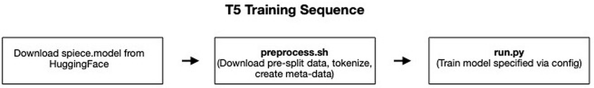

# T5 Language Model

- [Model overview](#model-overview)
  - [T5](#T5)
- [Sequence of the steps to perform](#Sequence-of-the-steps-to-perform)
- [Key features from CSoft platform used in this reference implementation](#Key-features-from-CSoft-platform-used-in-this-reference-implementation)
- [Code structure](#code-structure)
- [Data processing](#data-processing)
  - [Colossal Clean Crawled Corpus dataset](#Colossal-Clean-Crawled-Corpus-dataset)
    - [C4 processing commands](#C4-processing-commands)
- [Input function pipeline](#input-function-pipeline)
- [Running model commands](#running-model-commands)
  - [Steps to compile and validate](#Steps-to-compile-and-validate)
  - [Steps to run train and eval on CS](#Steps-to-run-train-and-eval-on-CS)
  - [Steps to run train and eval on GPU and CPU](#Steps-to-run-train-and-eval-on-GPU-and-CPU)
- [Implementation notes](#implementation-notes)
- [Configs included for this model](#Configs-included-for-this-model)
- [Citations](#citations)

# Model overview
## T5 
This directory contains the implementation of the T5 encoder-decoder transformer model, extending the transformer architecture originally introduced in [\[1\]](https://arxiv.org/abs/1706.03762).

The T5 model [\[2\]](https://arxiv.org/abs/1910.10683) is the best language model achieved from Google after testing variations on architectures (encoder-only, decoder-only, and encoder-decoder) and training objectives (language-modeling and denoising) given the recent success of transformers. The original paper trained with unsupervised and supervised data, but we follow the improvement in T5.1.1 [\[3\]](https://github.com/google-research/text-to-text-transfer-transformer/blob/main/released_checkpoints.md#t511) to only train with the unsupervised objective.

The model also formulates arbitrary NLP tasks into the same "text-to-text" format such that their model can be directly applied to any task without changing the architecture by adding new layers. Therefore, fine-tuning the model is a simple process of loading the pre-trained weights and changing the dataset. The model will then use the representations it learned from unsupervised pre-training to more easily adapt to the new task. 

For further detail on choices for architecture, training objectives, and data format, we refer to the T5 paper.  

# Sequence of the steps to perform
* Data-processing and tokenization
    * Elaborated in the [Data Processing Commands](#data-processing) section.
* Training the model on CS system or GPU using `run.py`
    * Elaborated in the [Running Model Commands](#running-model-commands) section.

The scripts to run, along with a short description of the functionality within each script is included in a diagram below:

<p align="center">
     
</p>
<p align="center">
    Training procedure for the T5 model. Bold files represent scripts to be run, with a short explanation underneath explaining the steps involved. The first step is not done with a script, but described below.
</p>

# Key features from CSoft platform used in this reference implementation
* T5 supports [Variable Sequence Length (VSL)](https://docs.cerebras.net/en/private/tensorflow-docs/tf-vsl.html) configurations.  At a high-level, this means that we can take advantage of Cerebras hardware's differences from GPU's to perform operations on different sized sequences in parallel, without requiring padding tokens. This reduces the amount of time spent on computations that are never used in the end. For more details, see [\[4\]](https://www.cerebras.net/software/increasing-model-throughput-with-variable-tensor-shape-computations/) and [\[5\]](https://docs.cerebras.net/en/private/tensorflow-docs/tf-vsl.html). To use VSL, simply add `use_vsl: True` to the `model` section of the configuration YAML file.
* T5 supports `--multireplica` flag can be used to perform data-parallel training across multiple copies of the model at the same time. To read more, please refer to [Multi-Replica Data Parallel Training](https://docs.cerebras.net/en/private/general/multi-replica-data-parallel-training.html) documentation page.
* T5 currently supports pipeline execution mode, in which the entire model is loaded onto the Wafer-Scale Engine (WSE) and data streams across the layers. See [\[6\]](https://docs.cerebras.net/en/latest/cerebras-basics/cerebras-execution-modes.html#layer-pipelined-mode) for further details. 


# Code structure 
The directory has the following structure:
* `model.py` contains the model function definition. It mostly combines code that it imports from `layers/` and from `../../../common/tf/layers/`.  
* `layers/` contains two files, `T5Encoder.py` and `T5Decoder.py`, which combines building blocks from `../../../common/tf/layers/` into the T5 structure. 
* `data.py` contains input data pipeline implementation.
* `configs/` contains YAML files with model configuration and training hyperparameters. This is a command-line argument to `run.py` that determines the model, data-loader, optimizer, and hyperparameters such as learning rate and total number of steps. 
* `run.py` contains the functionality to launch training on CS system and GPU.
* `utils.py` contains helper functions for other scripts.

# Data processing 
## T5 data overview: Colossal Clean Crawled Corpus dataset
The Colossal Clean Crawled Corpus (C4) Dataset is a publicly-available dataset hosted [here](https://www.tensorflow.org/datasets/catalog/c4), based on cleaning ~7 TB of data from [Common Crawl](https://commoncrawl.org/). See Section 2.2 of [\[2\]](https://arxiv.org/abs/1910.10683) for further details.
The following commands handle formatting of this dataset for you, but if you decide to change the dataset or dataloaders, 
make sure you follow the same input function pipeline as described in [Input function pipeline](#input-function-pipeline).

### C4 processing commands 
Download the pre-trained tokenizer model from [HuggingFace](https://huggingface.co/google/t5-11b-ssm-nq/blob/main/spiece.model). Place it in the `./input/` directory.

Move to the `./input/` directory, and simply run [preprocess.sh](./input/preprocess.sh) script:

```bash
bash preprocess.sh
```

By running it, you will download C4 from HuggingFace and tokenize it using the [sentencepiece](https://github.com/google/sentencepiece) tokenizer. The tokens for Tensorflow and PyTorch models are the same, so this only needs to be run once.  

Note: it saves the data to `./c4` directory, but this can be changed easily by adjusting the first line in the `preprocess.sh` script that specifies `dataset_root`. Since the dataset is extremely large, it takes ~56 hours on a 4 cpu core machine. However, it can easily be parallelized across multiple nodes. 

# Input function pipeline
For details about the input function pipeline used for the models located in this folder, please refer to a separate documentation [input/README.md](input/README.md).


# Running model commands
## Steps to compile and validate 
If you are developing new features for the model, you can test whether the changes are compatible with the Cerebras software stack by compiling on CPU. You do not need to test this on the Cerebras system, so you could test compilation on CPU while you are training an established model on the CS system.  

There are two compilation tests you can run: `--validate_only` and `--compile_only`, with sample commands below. The `--validate_only` flag is more lightweight, and will test whether the code completes our kernel-matching process. The `--compile_only` flag tests the full compilation to generate the binary executable that will run on the CS system. 

Compilation validation command:
```
csrun_cpu python run.py --mode=train --validate_only --model_dir /path/to/model_dir
```

Full compilation command:
```
csrun_cpu python run.py --mode=train --compile_only --model_dir /path/to/model_dir
```

## Steps to run train and eval on CS
For running within Cerebras environment, use the below command. Note: `--mode eval` can be used instead of `--mode train` to move the Tensorflow model to evaluation mode. 
```
csrun_wse python run.py --mode train --cs_ip x.x.x.x --params path/to/yaml --model_dir /path/to/model_dir
```

## Steps to run train and eval on GPU and CPU 
If you want to run on GPU for reference, use the following command:
```
python run.py --mode train --params path/to/yaml --model_dir /path/to/model_dir
```

For each of these commands, 
* `path/to/yaml` is a path to the YAML configuration file containing the model parameters. Parameters for the base configuration of the model are provided in the section [Configs included for this model](#Configs-included-for-this-model).
* `path/to/model_dir` is the path to the model directory where compile and training artifacts will be saved. 

# Implementation notes
There are a couple modifications to the T5 implementation based on current support for operations on CS systems. Resolving these is currently work in progress:
1. We do not currently support the Adafactor optimizer used to train the original T5 model. Instead we use AdamW, which results in a higher loss at the end of pre-training.
2. We do not currently support `RMSNorm` [\[10\]](https://arxiv.org/abs/1910.07467). Instead, we use `LayerNorm` [\[11\]](https://arxiv.org/abs/1607.06450v1) as our normalization layer. 

# Configs included for this model 
In the [configs](./configs/) directory we have files:
* [T5-base](configs/params_base.yaml) have a base reference with `d_kv=64`, `num_heads=12`, `encoder_num_hidden_layers=12`.
* [T5-small](configs/params_small.yaml) have a small reference with `d_kv=64`, `num_heads=6`, `encoder_num_hidden_layers=8`.

VSL is enabled in both configs. These configs are just examples, and can be adjusted for any desired training procedure, including different model sizes, different optimizer settings, and different number of training steps.


## Citations
[1] [Attention Is All You Need](https://arxiv.org/abs/1706.03762) 

[2] [Exploring the Limits of Transfer Learning with a Unified Text-to-text Transformer](https://arxiv.org/abs/1910.10683).

[3] [T5v1.1](https://github.com/google-research/text-to-text-transfer-transformer/blob/main/released_checkpoints.md#t511).

[4] [VTS Conceptual Explanation Blog](https://www.cerebras.net/software/increasing-model-throughput-with-variable-tensor-shape-computations/)

[5] [VSL Software Documentation](https://docs.cerebras.net/en/private/tensorflow-docs/tf-vsl.html)

[6] [Pipeline Execution Mode](https://docs.cerebras.net/en/latest/cerebras-basics/cerebras-execution-modes.html#layer-pipelined-mode)

[7] [Adam](https://arxiv.org/abs/1412.6980)

[8] [AdamW](https://arxiv.org/abs/1711.05101)

[9] [Adafactor](https://arxiv.org/abs/1804.04235)

[10] [RMSNorm](https://arxiv.org/abs/1910.07467)

[11] [LayerNorm](https://arxiv.org/abs/1607.06450v1)

